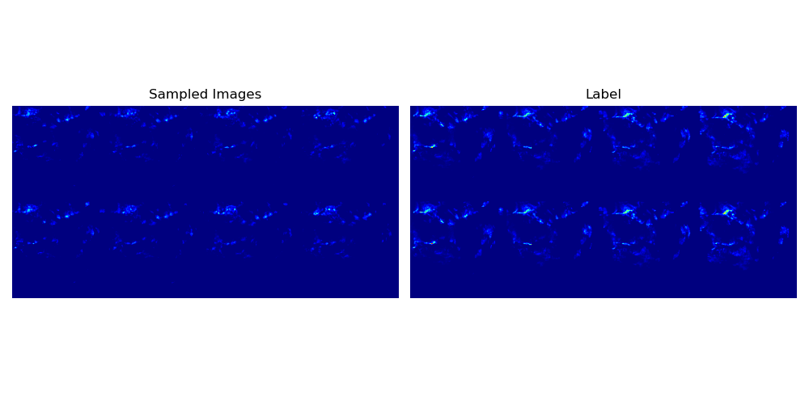

# SRNDiff

# how to use


```python
python sample.py
```

The weights can be accessed at the following address:
https://drive.google.com/file/d/1sZsT_Qe0_9kmXIfT8fRuZ9Rj5wY37Bbr/view?usp=drive_link


The following result will appear



# Requirement
You only need to save torch>=0.13.1 cuda>=11.7, python>=3.7, there are no specific requirements for other packages
```
pip install torch==1.13.1+cu117 torchvision==0.14.1+cu117 torchaudio==0.13.1 --extra-index-url https://download.pytorch.org/whl/cu117
```


```
torch==1.13.1
torchvision==0.14.1
tqdm==4.64.1
einops==0.6.0
matplotlib==3.5.3
numpy==1.21.6
```


# TO DO
- [x] Upload the complete inference code
- [x] Visualize the results
- [ ] Improve the training code
- [ ] Upload the attention layer visualization code
- [ ] Provide operating environment


# BibTeX
If you find this paper/project helpful, please cite us.

```
@article{ling2024srndiff,
  title={SRNDiff: Short-term Rainfall Nowcasting with Condition Diffusion Model},
  author={Ling, Xudong and Li, Chaorong and Qin, Fengqing and Yang, Peng and Huang, Yuanyuan},
  journal={arXiv preprint arXiv:2402.13737},
  year={2024}
}
```